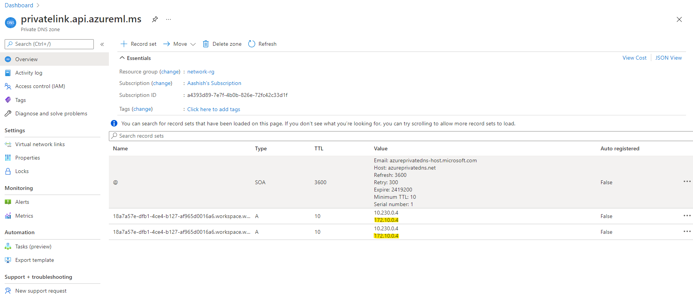
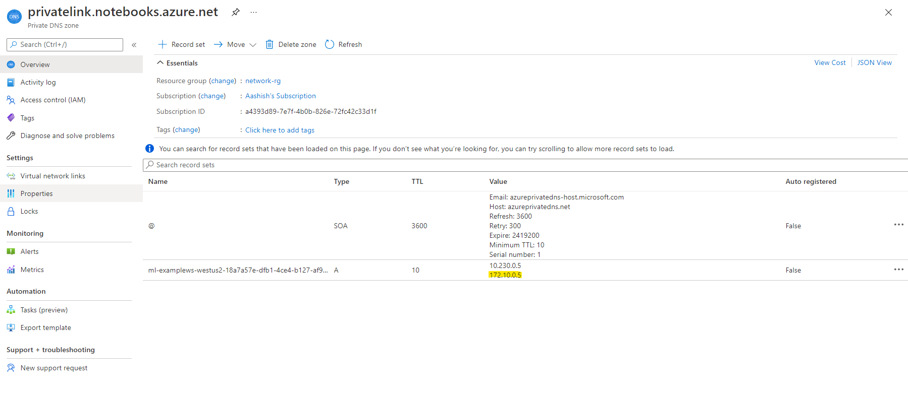
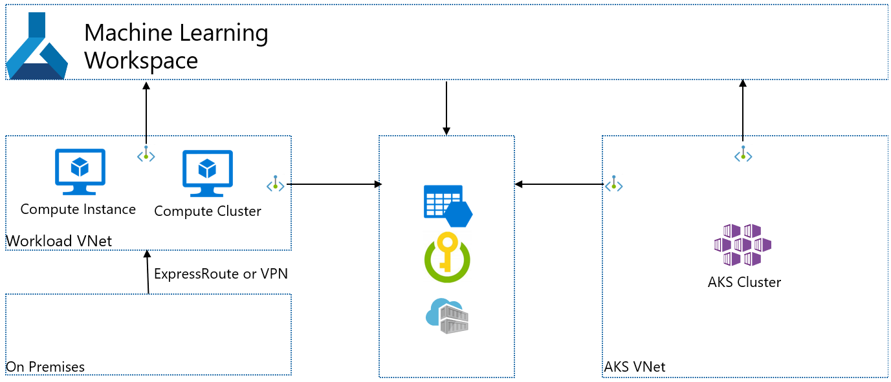
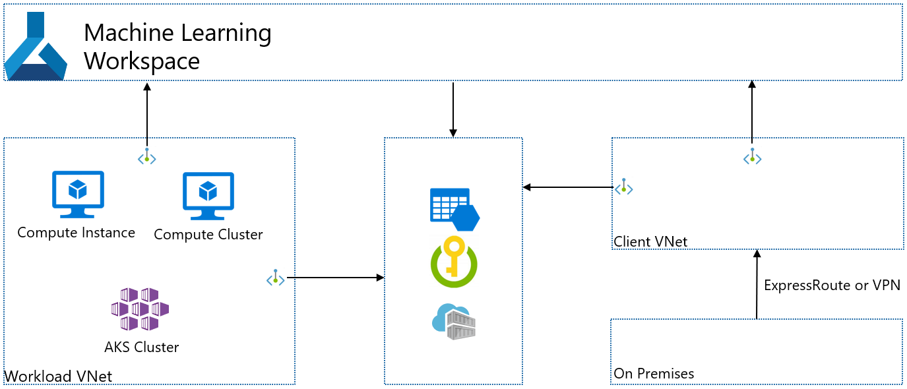

# Azure ML multiple private endpoints support (private preview)

## Enable Your Subscriptions for Private Preview
Submit this [form](https://forms.office.com/r/dcVvterjb3).

## Supported Scenarios as private preview
* AKS in the different VNet
* Access from the different VNet

## Current Limitation
- Azure portal does not support more than 2 PE creations. Please use CLI command to create 2nd PE.
- Current CLI command overwrites the DNS A record for your first PE in your private DNS zone. Add the IP of your first PE in the A record in your private DNS zone.
- Azure ML recognizes your first PE for workspace as the default PE. The only VNet of the default PE is shown in the compute creation in AML Studio UX. You cannot choose another vnet associated with your 2nd PE on studio UX. Please create your first PE that is associated with the VNet you want to create compute resources. If you want to create compute in 2nd VNet, please use ARM template.
- Notebook on Studio UX can be used only from the 2nd PE's VNet. This is a bug to be fixed.

## How to Create 2nd PE for AzureML Workspace

1. Use this CLI command to add PE to your workspace. [Doc](https://docs.microsoft.com/en-us/azure/machine-learning/how-to-configure-private-link?tabs=azure-cli#add-a-private-endpoint-to-a-workspace)

```json
Command
    az ml workspace private-endpoint add : Add private endpoint to a workspace.

Arguments
    --output-metadata-file -t : Provide an optional output file location for structured object
                                output.
    --path                    : Path to a root directory for run configuration files.  Default: ..
    --pe-auto-approval        : Whether private endpoint connections to the workspace resource via a
                                private link should be auto approved.
    --pe-location             : Location of the workspace private endpoint. If not specified it will
                                be the same location of the workspace.
    --pe-name                 : Name of the workspace private endpoint. Use this parameter to
                                restrict workspace access to private networks, via a private
                                endpoint.
    --pe-resource-group       : Name of the existing resource group to create the workspace private
                                endpoint in. The vnet should be in the same resource group. If not
                                specified, the resource group of the workspace will be used.
    --pe-subnet-name          : Name of the existing subnet to create the workspace private endpoint
                                in.  Default: default.
    --pe-subscription-id      : Id of the existing subscription to create the workspace private
                                endpoint in. The vnet should be in the same subscription. If not
                                specified, the subscription Id of the workspace will be used.
    --pe-vnet-name            : Name of the existing vnet to create the workspace private endpoint
                                in.
    --resource-group -g       : Resource group name.
    --subscription-id         : Specifies the subscription Id.
    --tags                    : Tags associated with this private endpoint with 'key=value' syntax.
    --workspace-name -w       : Workspace name.
```
2. Add the private IP of your first PE in the A record in your private dns zone.
Below are the example screenshots. You should have the IP of 2nd PE in the A record for AzureML workspace. You need to add the IP of 1st PE in the A record again that is highlighted by yellow. Note that your IP should be different. 



## Scenario1: AKS in the different VNet



### Configurations
I assume you have an AzureML workspace with single PE.
1. Create another workspace PE for your AKS VNet.
2. Create associated resources(storage, KV, ACR) PEs for your AKS VNet.
3. Attach your AKS to AzureML workpsace [Doc](https://docs.microsoft.com/en-us/azure/machine-learning/how-to-create-attach-kubernetes?tabs=azure-cli#attach-an-existing-aks-cluster) or on Studio UX. Use [AKS ARM template](https://github.com/Azure/azure-quickstart-templates/tree/master/quickstarts/microsoft.machinelearningservices/machine-learning-compute-create-akscompute) if you want to create a new AKS clsuter.

### Known Issues
- Your A record for AzureML workspace in private dns zone will be overwritten by 2nd PE creation. Do Action 2 of [this section](#how-to-create-2nd-pe-for-azureml-workspace).
- Notebook on Studio UX can be used only from the 2nd PE's VNet, in this case, AKS VNet. This is a bug to be fixed.
- You cannot choose the 2nd VNet on Studio UX(known issue).

## Scenario2: Access from the different VNet



### Worklaod VNet Configurations
1. Allow inbound access from service tag "azuremachinelearning" and "batchnodemanagement". [Doc](https://docs.microsoft.com/en-us/azure/machine-learning/how-to-secure-training-vnet#mlcports)
2. Allow outbound access to several service tags. [Doc](https://docs.microsoft.com/en-us/azure/machine-learning/how-to-access-azureml-behind-firewall#outbound-configuration)
3. Create PEs for associated resources. (Blob/File of default storage, keyvault and ACR) Enable Private DNS Zones integration.
4. If you have additional storage, please create a PE for that with Private DNS Zones integration.

### Client VNet Configurations
1. Create PEs for blob/file of default storage. Enable private DNS zones integration.
2. If you have additional storage, please create a PE for that with Private DNS zones integration.

### Workspace Managed Identity Configurations [Doc](https://docs.microsoft.com/en-us/azure/machine-learning/how-to-enable-studio-virtual-network)
1. Reader access to the PE of storages
  * For the default blob storage, reader access to the PEs(both blob and file) in Client VNet.
  * For the additionally attached storage, reader access to the PE in Client VNet.
2. Blob contributor access of the default storage and additionally attached storage
3. Managed Idnetity configuration on Studio UX for the additionally attached storage

### Known Issues
* Your A record for AzureML workspace in private dns zone will be overwritten by 2nd PE creation. Do Action 2 of [this section](#how-to-create-2nd-pe-for-azureml-workspace).
* Create an AzureML workpsace PE for Workload VNet to choose workload vnet information on AzureML studio UX.
  * If you want to create compute in Client VNet, please use following templates. [Compute Instance](https://github.com/Azure/azure-quickstart-templates/tree/master/quickstarts/microsoft.machinelearningservices/machine-learning-compute-create-computeinstance), [Compute Cluster](https://github.com/Azure/azure-quickstart-templates/tree/master/quickstarts/microsoft.machinelearningservices/machine-learning-compute-create-amlcompute), [AKS](https://github.com/Azure/azure-quickstart-templates/tree/master/quickstarts/microsoft.machinelearningservices/machine-learning-compute-create-akscompute).
* Notebook on Studio UX can be used only from the 2nd PE's VNet, in this case, Client VNet. This is a bug to be fixed.

